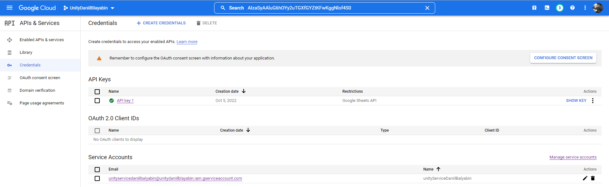
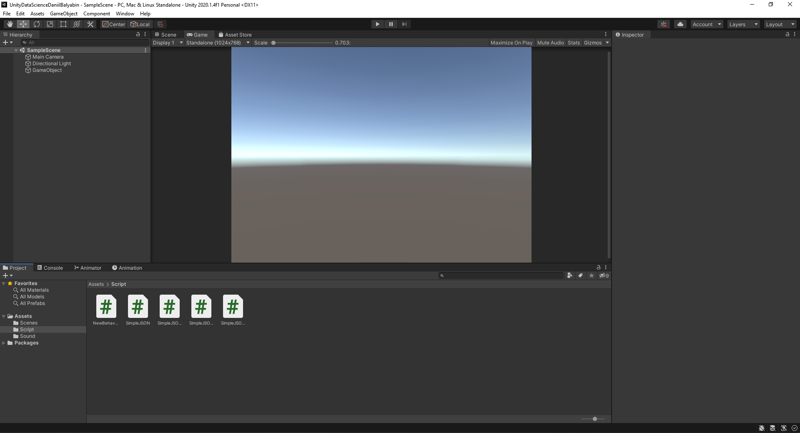

# АНАЛИЗ ДАННЫХ И ИСКУССТВЕННЫЙ ИНТЕЛЛЕКТ [in GameDev]
## Сбор, обработка и визуализация тестового набора данных.
Отчет по лабораторной работе #2 выполнил:
- Балябин Даниил Сергеевич
- ХИВТ31

Отметка о выполнении заданий:

| Задание | Выполнение | Баллы |
| ------ | ------ | ------ |
| Задание 1 | * | 60 |
| Задание 2 | # | 20 |
| Задание 3 | # | 20 |

знак "*" - задание выполнено; знак "#" - задание не выполнено;

Работу проверили:
- к.т.н., доцент Денисов Д.В.
- к.э.н., доцент Панов М.А.
- ст. преп., Фадеев В.О.

## Цель работы
Познакомиться с программными средствами для организции передачи данных между инструментами google, Python и Unity

## Задание 1
### Реализовать совместную работу и передачу данных в связке Python - Google-Sheets – Unity. 
Ход работы:
- В облачном сервисе google console подключить API для работы с google sheets и google drive.

- Реализовать запись данных из скрипта на python в google-таблицу. Данные описывают изменение темпа инфляции на протяжении 11 отсчётных периодов, с учётом стоимости игрового объекта в каждый период.

- Создать новый проект на Unity, который будет получать данные из google-таблицы, в которую были записаны данные в предыдущем пункте.

- Написать функционал на Unity, в котором будет воспризводиться аудио-файл в зависимости от значения данных из таблицы.

## Задание 2
### Реализовать запись в Google-таблицу набора данных, полученных с помощью линейной регрессии из лабораторной работы № 1. 

## Задание 3
### Самостоятельно разработать сценарий воспроизведения звукового сопровождения в Unity в зависимости от изменения считанных данных в задании 2.

## Выводы

Мне было довольно тяжело разобраться со связкой Unity + Python + Sheets. Я не успел сделать 2 и 3 задание. Но, как и с прошлой лабораторной работой, я разберусь и доделаю задание (для себя конечно). Считаю проделанную работу с пониманием удовлетворительной. Свою работу с дедлайнами - отвратительной.

| Plugin | README |
| ------ | ------ |
| Dropbox | [plugins/dropbox/README.md][PlDb] |
| GitHub | [plugins/github/README.md][PlGh] |
| Google Drive | [plugins/googledrive/README.md][PlGd] |
| OneDrive | [plugins/onedrive/README.md][PlOd] |
| Medium | [plugins/medium/README.md][PlMe] |
| Google Analytics | [plugins/googleanalytics/README.md][PlGa] |

## Powered by

**BigDigital Team: Denisov | Fadeev | Panov**
